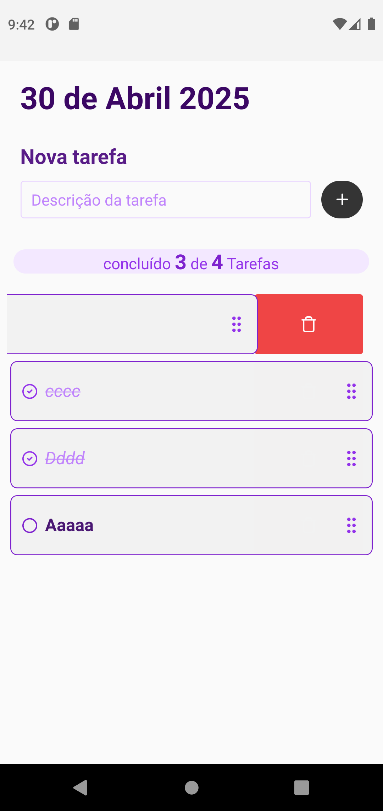

# Evolved World ToDo

## :computer: Sobre <a id = "sobre"></a>

Projeto desenvolvido como teste técnico. Um aplicativo que permite criar e remover de uma lista de tarefas, permitindo que cada tarefa possa ser marcada como concluída e salvando essas alterações no banco de dados.

## 🎨 Layout <a id = "sobre"></a>

<span style="display: flex;align-items: flex-start; overflow-x: auto; gap: 5px;">
 
</span>

## Technologies <a id="tecs"></a>

### Requirements

-   [![git-badge]](https://git-scm.com)
-   [![nodejs-badge]](https://nodejs.org/en)
-   [![yarn-badge]](https://yarnpkg.com/) or [![npm]](https://www.npmjs.com/)

### Languages, frameworks and libs

-   [![typescript]](https://www.typescriptlang.org/)
-   [![React]](https://reactjs.org/)
-   [![zod]](https://zod.dev/)
-   [![firebase]](https://console.firebase.google.com/)
-   [React-hook-form](https://react-hook-form.com/)
-   [Nativewind](https://www.nativewind.dev/)
-   [Gluestack-ui](https://www.nativewind.dev/)

## 🚀 Run project

```bash

 #install dependencies
 yarn # or npm install

 #start metro bundler
 yarn start # or npm run dev

 #run on android device
 yarn android
```

## 🔨 Build a APK release version

```bash

 #generate the key-store file
 # rode este comando na raiz do projeto e preencha a senha como "testetodo"
 # caso altere o key-alias, a senha, o nome ou local do arquivo, atualiza essas informações no arquivo android/gradle.properties
 keytool -genkeypair -v -keystore android/app/my-release-keyteste.keystore -alias my-key-alias -keyalg RSA -keysize 2048 -validity 10000

 #comando para gerar seu apk release
 #seu apk será gerado em android/app/build/outputs/apk/release/app-release.apk
  cd android && ./gradlew assembleRelease

 #run on android device
 yarn android
```

## 🔨 Run firebase local emulator (Optional)

```bash

 #Rode o emulator firebase indicando o id do projeto
  firebase emulators:start --project test-44a4e

 #va ao arquivo e src/lib/firestore.ts e descomente o código e altere o endereço local se necessário
```

## Autor

<a alt="Linkedin" href="https: //linkedin/in/josueplacido">
 
 <br />
 <sub><b>Josué Placido</b></sub></a>

Developed ❤️ by Josué Placido! 👋🏽

[](https://www.linkedin.com/in/josueplacido/)
[](mailto:juplacido.jnr@gmail.com)
[![Hotmail Badge](https://img.shields.io/badge/-ozzyplacidojunior@hotmail.com-blue?style=flat-square&logo=data:image/svg+xml;base64,PCFET0NUWVBFIHN2ZyBQVUJMSUMgIi0vL1czQy8vRFREIFNWRyAxLjEvL0VOIiAiaHR0cDovL3d3dy53My5vcmcvR3JhcGhpY3MvU1ZHLzEuMS9EVEQvc3ZnMTEuZHRkIj4KDTwhLS0gVXBsb2FkZWQgdG86IFNWRyBSZXBvLCB3d3cuc3ZncmVwby5jb20sIFRyYW5zZm9ybWVkIGJ5OiBTVkcgUmVwbyBNaXhlciBUb29scyAtLT4KPHN2ZyB3aWR0aD0iODAwcHgiIGhlaWdodD0iODAwcHgiIHZpZXdCb3g9IjAgMCAzMiAzMiIgeG1sbnM9Imh0dHA6Ly93d3cudzMub3JnLzIwMDAvc3ZnIiBmaWxsPSIjZmZmZmZmIj4KDTxnIGlkPSJTVkdSZXBvX2JnQ2FycmllciIgc3Ryb2tlLXdpZHRoPSIwIi8+Cg08ZyBpZD0iU1ZHUmVwb190cmFjZXJDYXJyaWVyIiBzdHJva2UtbGluZWNhcD0icm91bmQiIHN0cm9rZS1saW5lam9pbj0icm91bmQiLz4KDTxnIGlkPSJTVkdSZXBvX2ljb25DYXJyaWVyIj4KDTx0aXRsZT5maWxlX3R5cGVfb3V0bG9vazwvdGl0bGU+Cg08cGF0aCBkPSJNMTkuNDg0LDcuOTM3djUuNDc3TDIxLjQsMTQuNjE5YS40ODkuNDg5LDAsMCwwLC4yMSwwbDguMjM4LTUuNTU0YTEuMTc0LDEuMTc0LDAsMCwwLS45NTktMS4xMjhaIiBzdHlsZT0iZmlsbDojZmFmYWZhIi8+Cg08cGF0aCBkPSJNMTkuNDg0LDE1LjQ1N2wxLjc0NywxLjJhLjUyMi41MjIsMCwwLDAsLjU0MywwYy0uMy4xODEsOC4wNzMtNS4zNzgsOC4wNzMtNS4zNzhWMjEuMzQ1YTEuNDA4LDEuNDA4LDAsMCwxLTEuNDksMS41NTVIMTkuNDgzVjE1LjQ1N1oiIHN0eWxlPSJmaWxsOiNmYWZhZmEiLz4KDTxwYXRoIGQ9Ik0xMC40NCwxMi45MzJhMS42MDksMS42MDksMCwwLDAtMS40Mi44MzgsNC4xMzEsNC4xMzEsMCwwLDAtLjUyNiwyLjIxOEE0LjA1LDQuMDUsMCwwLDAsOS4wMiwxOC4yYTEuNiwxLjYsMCwwLDAsMi43NzEuMDIyLDQuMDE0LDQuMDE0LDAsMCwwLC41MTUtMi4yLDQuMzY5LDQuMzY5LDAsMCwwLS41LTIuMjgxQTEuNTM2LDEuNTM2LDAsMCwwLDEwLjQ0LDEyLjkzMloiIHN0eWxlPSJmaWxsOiNmYWZhZmEiLz4KDTxwYXRoIGQ9Ik0yLjE1Myw1LjE1NVYyNi41ODJMMTguNDUzLDMwVjJaTTEzLjA2MSwxOS40OTFhMy4yMzEsMy4yMzEsMCwwLDEtMi43LDEuMzYxLDMuMTksMy4xOSwwLDAsMS0yLjY0LTEuMzE4QTUuNDU5LDUuNDU5LDAsMCwxLDYuNzA2LDE2LjFhNS44NjgsNS44NjgsMCwwLDEsMS4wMzYtMy42MTZBMy4yNjcsMy4yNjcsMCwwLDEsMTAuNDg2LDExLjFhMy4xMTYsMy4xMTYsMCwwLDEsMi42MSwxLjMyMSw1LjYzOSw1LjYzOSwwLDAsMSwxLDMuNDg0QTUuNzYzLDUuNzYzLDAsMCwxLDEzLjA2MSwxOS40OTFaIiBzdHlsZT0iZmlsbDojZmFmYWZhIi8+Cg08L2c+Cg08L3N2Zz4=&link=mailto:ozzyplacidojunior@hotmail.com)](mailto:ozzyplacidojunior@hotmail.com)

<!-- variaveis badges -->

[nodejs-badge]: https://img.shields.io/badge/NODE.JS-339933?style=flat&logo=Node.js&logoColor=ffffff
[git-badge]: https://img.shields.io/badge/GIT-E44C30?style=flat&logo=git&logoColor=ffffff&labelColor=E44C30
[yarn-badge]: https://img.shields.io/badge/YARN-2C8EBB?style=flat&logo=yarn&logoColor=ffffff
[npm-badge]: https://img.shields.io/badge/any_text-18.18.x-black?style=flat&logo=Node.js&logoColor=ffffff&label=NodeJs&labelColor=339933
[npm]: https://img.shields.io/badge/NPM-CB3837?style=flat&logo=npm&logoColor=ffffff
[React]: https://img.shields.io/badge/19.0.x-5D5D5D?style=flat&logo=react&label=REACT&labelColor=20232A
[typescript]: https://img.shields.io/badge/5.x-5D5D5D?style=flat&logo=typescript&logoColor=fff&label=TYPESCRIPT&labelColor=007ACC
[zod]: https://img.shields.io/badge/ZOD-000?style=flat&logo=zod&logoColor=3068B7
[firebase]: https://img.shields.io/badge/FIREBASE-ffca28?style=flat&logo=firebase&logoColor=black
